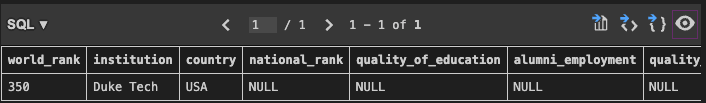
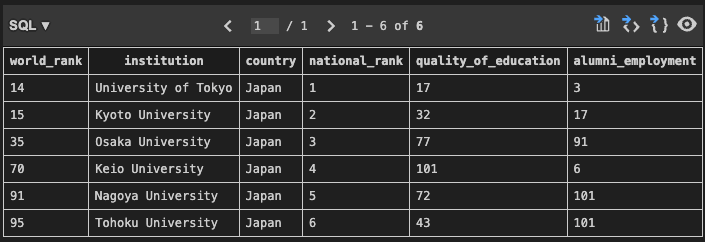
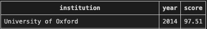
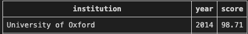
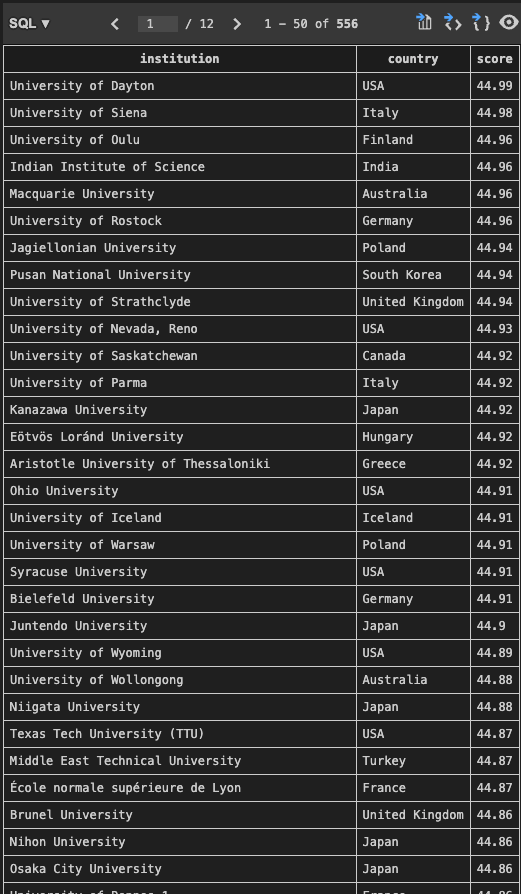
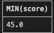

# Week 6 - Mini- Assignment Introduction to Databases

## Connect to Database
Successfully connected to the database using SQLite3 command line.

Used: VSCode SQLite Extension
1.  `Cmd+Shift+P` to open Command Palette
2. Type "SQLite: Open Database"
3. Select `university_database.db`
4. Database opened successfully in SQLite Explorer

Database:
- Database file: `university_database.db`
- Table name: `university_rankings`

The `university_rankings` table contains 14 columns:
- world_rank
- institution
- country
- national_rank
- quality_of_education
- alumni_employment
- quality_of_faculty
- publications
- influence
- citations
- broad_impact
- patents
- score
- year

---

## Basic Analysis
Used: VSCode SQLite Extension
1.  `Cmd+Shift+P` to open Command Palette
2. Type "SQLite: New Query"
3. Type in queries to run analysis
4. Right click on each query to run them separetely

## Results from basic analysis:
### Total Universities: 2200
```sql
SELECT COUNT(*) FROM university_rankings;
```

### Years included: 2012, 2013, 2014, 2015
```sql
SELECT DISTINCT year FROM university_rankings;
```

### Number of Countries Included: 59
```sql
SELECT COUNT(DISTINCT country) FROM university_rankings;
```

### Number of Universities per year:
```sql
SELECT year, COUNT(*) 
FROM university_rankings 
GROUP BY year;
```

| Year | Number of Universities |
|------|------------------------|
| 2012 | 100                    |
| 2013 | 100                    |
| 2014 | 1000                   |
| 2015 | 1000                   |

### Maximum Score: 100.0
```sql
SELECT MAX(score) FROM university_rankings;
```

### Minimum Score: 43.36
```sql
SELECT MIN(score) FROM university_rankings;
```

### Average Score: ~47.80
```sql
SELECT AVG(score) FROM university_rankings;
```

### Top 5 Universities in 2015: 
```sql
SELECT institution, country, score
FROM university_rankings
WHERE year = 2015
ORDER BY score DESC
LIMIT 5;
```
| Institution | Country | Score |
|-------------|---------|-------|
| Harvard University | USA | 100.0 |
| Stanford University | USA | 98.66 |
| Massachusetts Institute of Technology | USA | 97.54 |
| University of Cambridge | United Kingdom | 96.81 |
| University of Oxford | United Kingdom | 96.46 |

### Top 5 countries with the most universities
```sql
SELECT country, COUNT(*) 
FROM university_rankings
GROUP BY country
ORDER BY COUNT(*) DESC
LIMIT 5;
```

| Country | Number of Universities |
|---------|------------------------|
| USA | 573 |
| China | 167 |
| Japan | 159 |
| United Kingdom | 144 |
| Germany | 115 |


### The number of US Universities: 573
```sql
SELECT COUNT(*) 
FROM university_rankings
WHERE country = 'USA';
```

### The average score by year:
```sql
SELECT year, AVG(score)
FROM university_rankings
GROUP BY year;
```

| Year | Average Score |
|------|---------------|
| 2012 | 54.94 |
| 2013 | 55.27 |
| 2014 | 47.27 |
| 2015 | 46.86 |

---

## CRUD Operations
### Insert Duke Tech into the database.
1. Inser Duke Tech into the database 
```sql
SELECT year, AVG(score)
FROM university_rankings
GROUP BY year;
```

2. Check the database to see if Duke Tech was added successfully
```sql
SELECT * FROM university_rankings 
WHERE institution = 'Duke Tech';
```

Result: Showed Duke Tech
Successfully added with correct information


### Count Japanese Universities
1. Find all Japanese universities in top 200 for 2013
```sql
SELECT * FROM university_rankings
WHERE country = 'Japan'
AND year = 2013
AND world_rank <= 200;
```
Result:


2. Count how many Japanese universities are in top 200
```sql
SELECT COUNT(*) FROM university_rankings
WHERE country = 'Japan'
AND year = 2013
AND world_rank <= 200;
```

Result: There are 6 Japanese universities in top 200

### Increase Oxford's Score to be correct
1. Check Oxford's current score in 2014
```sql
SELECT institution, year, score
FROM university_rankings
WHERE institution LIKE '%Oxford%'
AND year = 2014;
```

Result: The current score is 97.51


2. Update Oxford's score
```sql
UPDATE university_rankings
SET score = score + 1.2
WHERE institution LIKE '%Oxford%'
AND year = 2014;
```

3. Check to make sure the score is successfully updated
```sql
SELECT institution, year, score
FROM university_rankings
WHERE institution LIKE '%Oxford%'
AND year = 2014;
```

Result: The current score is 98.71


### Clean up records to delete universities with a score below 45 in 2015
1. Check the universities with a score below 45 in 2015
```sql
SELECT institution, country, score
FROM university_rankings
WHERE year = 2015
AND score < 45;
```
Result: A long list of 556 universities with scores below 45


2. Count the number of universities to be deleted
```sql
SELECT COUNT(*)
FROM university_rankings
WHERE year = 2015
AND score < 45;
```

Result: 556

3. Delete Universities with score below 45 in 2015

```sql
DELETE FROM university_rankings
WHERE year = 2015
AND score < 45;
```

4. Count how many universities are left in 2015
```sql
SELECT COUNT(*)
FROM university_rankings
WHERE year = 2015;
```

Result: 444 Universities

5. Check the current minimum score to be sure the unwanted universities are deleted
```sql
SELECT MIN(score)
FROM university_rankings
WHERE year = 2015;
```

Result: 45.0
